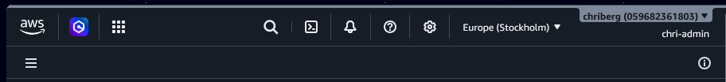
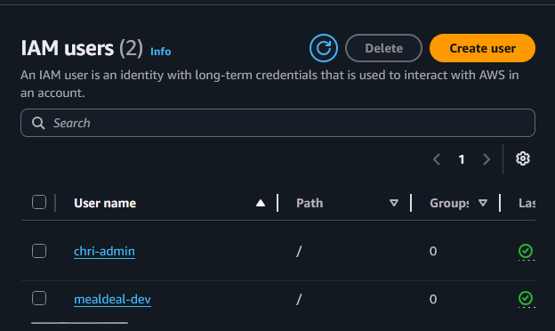
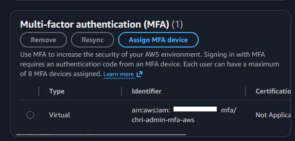
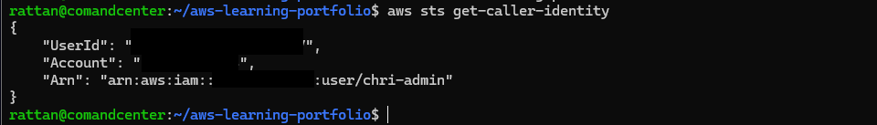

# AWS Account Setup

## Objective

Prepare an AWS account for secure administration and future cloud projects.

## What I Did

- Verified AWS account access
- Reviewed the AWS Management Console
- Reviewed IAM security recommendations
- Enabled Multi-Factor Authentication (MFA)
- Verified AWS CLI authentication

---

## AWS Management Console



The AWS Management Console is the primary interface used to manage AWS resources and services.

Skills demonstrated:

- AWS Navigation
- Cloud Administration
- AWS Services Overview

---

## IAM Dashboard



The IAM Dashboard provides an overview of identity management and account security settings.

Skills demonstrated:

- IAM Administration
- Security Monitoring
- AWS Best Practices

---

## MFA Configuration



Multi-Factor Authentication was enabled to improve account security and follow AWS security best practices.

Skills demonstrated:

- IAM
- MFA
- Account Security

---

## AWS CLI Verification



The command below was used to verify that the AWS CLI was correctly configured and authenticated.

```bash
aws sts get-caller-identity
```

Skills demonstrated:

- AWS CLI
- AWS STS
- Authentication
- Command Line Administration

---

## What I Learned

- AWS account administration
- IAM fundamentals
- MFA configuration
- AWS CLI authentication
- AWS security best practices

## Technologies Used

- AWS Management Console
- AWS IAM
- AWS CLI
- AWS STS
```
