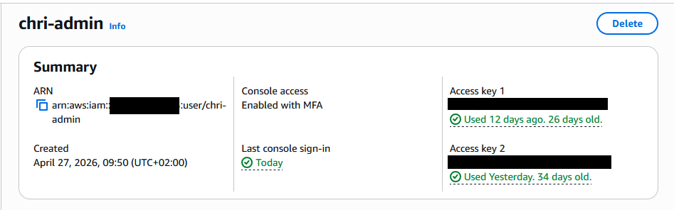
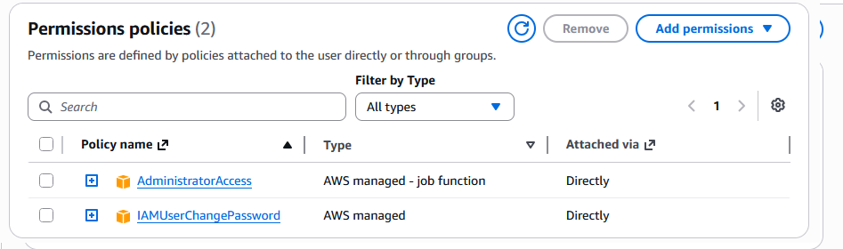
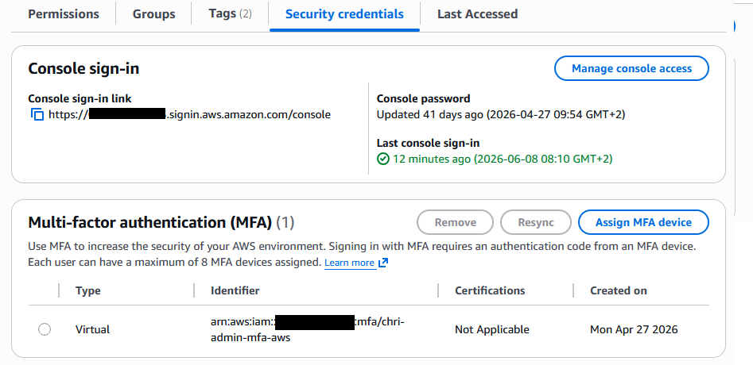
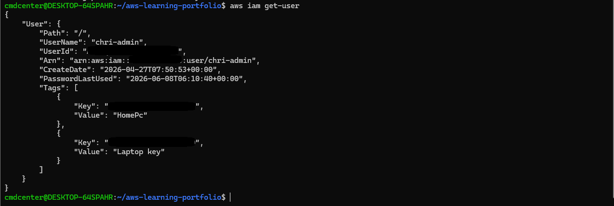

# IAM Security

## Objective

Learn how AWS IAM is used to manage users, permissions and account security.

## What I Did

* Reviewed IAM user configuration
* Examined assigned permissions
* Verified security credentials
* Queried IAM information using AWS CLI

---

## User Overview



The IAM user *chri-admin* was reviewed to verify account configuration, console access and security settings.

The user has console access enabled and is protected by Multi-Factor Authentication (MFA), which adds an additional layer of security during login.

---

## User Permissions



Permissions in AWS IAM are managed through policies.

The user was assigned the AdministratorAccess policy, which grants administrative access to AWS services, and the IAMUserChangePassword policy, which allows the user to manage their own password.

This demonstrates how permissions can be assigned directly to IAM users and managed through AWS Identity and Access Management (IAM).

---

## Security Credentials



Security credentials are used to control how users authenticate to AWS.

The user was configured with console access and protected using Multi-Factor Authentication (MFA). MFA requires a second authentication factor in addition to a password, significantly improving account security.

The screenshot also shows the configured MFA device and console sign-in configuration.

---

## AWS CLI User Information



The AWS CLI can be used to retrieve IAM user information directly from the command line.

The command below was used to display information about the current IAM user:

```bash
aws iam get-user
```

The output contains details such as the username, creation date, ARN and assigned tags.

Using the AWS CLI makes it possible to automate administrative tasks and manage AWS resources without using the web console.

---

## What I Learned

* How IAM users are managed
* How permissions are assigned through policies
* How MFA improves account security
* How to retrieve IAM information using AWS CLI
* AWS Identity and Access Management fundamentals

---

## Technologies Used

* AWS IAM
* AWS CLI
* Multi-Factor Authentication (MFA)
* AWS Management Console
* AWS Security Token Service (STS)
