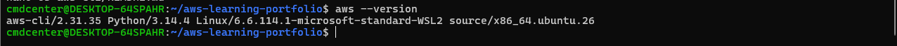
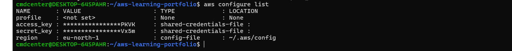
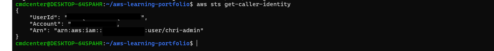
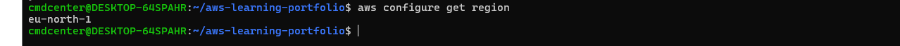

# AWS CLI

## Objective

Learn how the AWS Command Line Interface (CLI) can be used to manage AWS resources and automate administrative tasks.

## What I Did

* Verified AWS CLI installation
* Reviewed CLI configuration
* Verified account authentication
* Retrieved AWS region information

---

## AWS CLI Installation



The AWS Command Line Interface (CLI) was installed and verified using the `aws --version` command.

The AWS CLI provides a command-line interface for interacting with AWS services and is commonly used for automation, scripting and infrastructure management.

---

## AWS CLI Configuration



The `aws configure list` command was used to review the active AWS CLI configuration.

The output shows where credentials and configuration values are loaded from, including access keys and the configured AWS region.

---

## Identity Verification



The command below was used to verify that the AWS CLI was correctly authenticated.

```bash
aws sts get-caller-identity
```

AWS Security Token Service (STS) returns information about the currently authenticated identity and confirms that the configured credentials are working correctly.

---

## AWS Region Configuration



The configured AWS region was verified using the AWS CLI.

AWS regions determine where resources are deployed and can affect availability, latency and pricing. In this environment the default region was configured as eu-north-1.

---

## What I Learned

* How to install and verify AWS CLI
* How AWS CLI stores configuration and credentials
* How to verify AWS authentication using STS
* How AWS regions are configured
* Basic command-line administration of AWS resources

---

## Technologies Used

* AWS CLI
* AWS STS
* AWS IAM
* Linux
* WSL2
