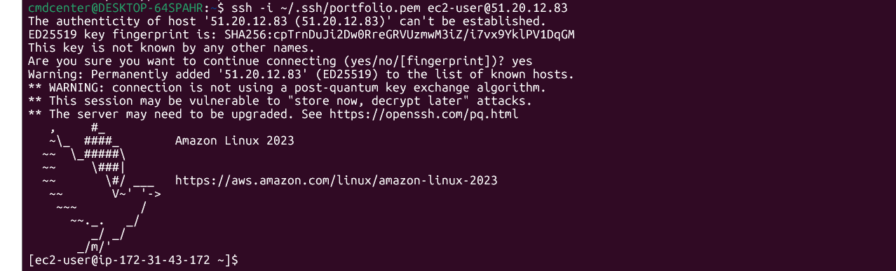
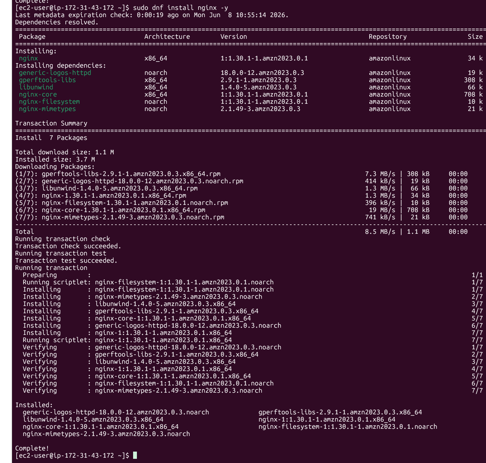
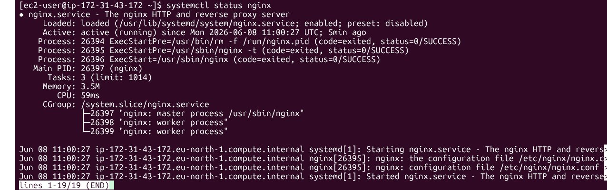
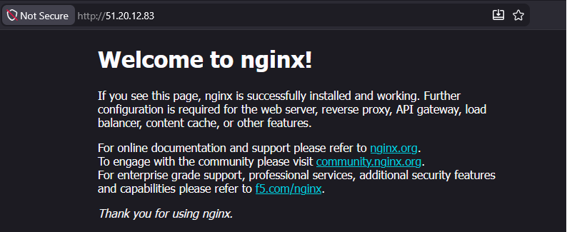

# EC2 Deployment

## Objective

Deploy and configure a Linux web server on AWS EC2 and verify that it is accessible from the internet.

## What I Did

* Created an EC2 instance
* Configured security group rules
* Connected to the server using SSH
* Installed Nginx
* Verified the web service status
* Confirmed public web access

---

## SSH Connection

The EC2 instance was accessed using SSH from a local Linux environment running in WSL.

SSH provides secure remote administration and is one of the most common methods used by system administrators to manage Linux servers.

---

## Nginx Installation

Nginx was installed using the Amazon Linux package manager.

The installation process automatically resolved dependencies and installed the required web server components.

---

## Service Verification

After installation, the Nginx service was started and verified using systemd.

The service status confirmed that Nginx was active and running correctly on the server.

---

## Public Web Server Verification

The web server was tested through the instance public IP address.

The default Nginx page was successfully displayed, confirming that the web server was accessible from the internet and that the security group rules were configured correctly.

---

## What I Learned

* How to deploy an EC2 instance
* How to connect to a Linux server using SSH
* How to install software using package managers
* How to manage services with systemd
* How to verify public web server access
* Basic AWS networking and security group configuration

---

## Technologies Used

* Amazon EC2
* Amazon Linux 2023
* SSH
* Nginx
* Security Groups
* Linux
* WSL2

