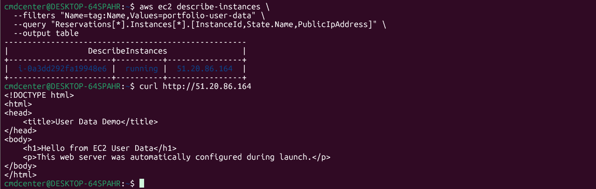
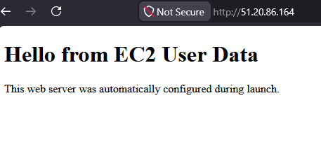

# User Data Automation

## Objective

Learn how AWS User Data can be used to automatically configure a server during launch.

## What I Did

* Created an EC2 instance using AWS CLI
* Created a User Data script
* Installed Nginx automatically during launch
* Created a custom web page automatically
* Verified the deployment using both curl and a web browser

---

## User Data Verification

The EC2 instance was launched using the AWS CLI and configured with a User Data script.

User Data allows administrators to automate server provisioning by executing commands automatically when an instance starts for the first time.

The script installed Nginx, started the service and created a custom HTML page without any manual interaction after launch.

---

## Public Web Page Verification

The custom web page was successfully displayed through the instance public IP address.

This confirmed that the User Data script executed correctly and that the web server was fully configured automatically during instance creation.

---

## How the User Data Script Worked

The User Data script performed the following tasks:

1. Updated the operating system packages
2. Installed Nginx
3. Enabled the Nginx service
4. Started the Nginx service
5. Created a custom web page

This allowed the server to become operational immediately after launch without requiring manual SSH configuration.

---

## What I Learned

* How AWS User Data works
* How to automate server provisioning
* How to launch EC2 instances using AWS CLI
* How to configure services automatically during deployment
* The benefits of Infrastructure Automation

---

## Technologies Used

* Amazon EC2
* AWS CLI
* User Data
* Amazon Linux 2023
* Nginx
* Linux
* WSL2
