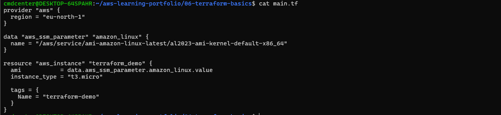
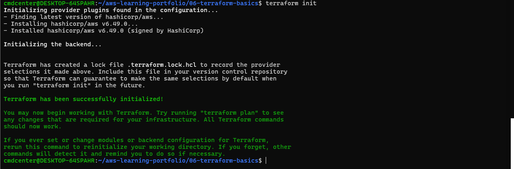
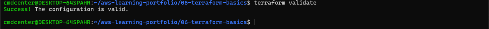
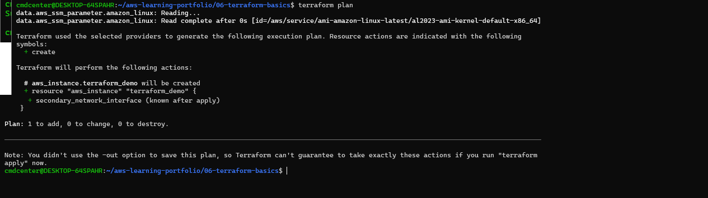
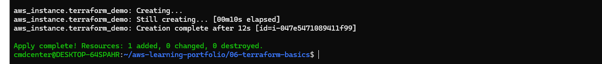
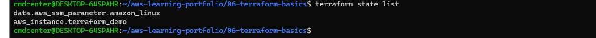
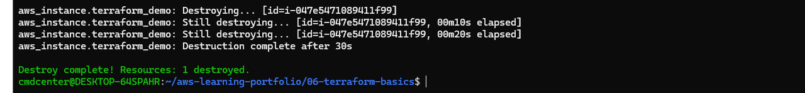

# Terraform Basics

## Objective

Learn the fundamentals of Infrastructure as Code (IaC) using Terraform and AWS.

## What I Did

- Created a Terraform configuration
- Used AWS SSM Parameter Store to retrieve the latest Amazon Linux AMI
- Initialized Terraform providers
- Validated the configuration
- Generated an execution plan
- Created AWS infrastructure
- Verified Terraform state management
- Destroyed the infrastructure

---

## Terraform Configuration

The Terraform configuration defined an AWS provider and an EC2 instance resource.

Instead of using a hardcoded AMI ID, the configuration retrieved the latest Amazon Linux 2023 image dynamically from AWS Systems Manager (SSM) Parameter Store.

This approach improves maintainability and ensures that the latest supported image is used.

---

## Terraform Initialization

The `terraform init` command downloaded the required AWS provider plugins and initialized the working directory.

This step prepares Terraform to interact with AWS resources.

---

## Terraform Validation

The `terraform validate` command was used to verify that the Terraform configuration was syntactically correct.

Validation helps identify errors before infrastructure is deployed.

---

## Terraform Plan

The `terraform plan` command generated a preview of the changes Terraform would make.

This showed that a new EC2 instance would be created and provided an opportunity to review changes before applying them.

---

## Terraform Apply

The `terraform apply` command created the AWS infrastructure defined in the configuration.

Terraform provisioned the EC2 instance and recorded the resource in its state file.

---

## Terraform State

Terraform state tracks the infrastructure resources managed by Terraform.

The state file allows Terraform to compare the desired configuration with the current infrastructure and determine what changes are required.

---

## Terraform Destroy

The `terraform destroy` command removed all resources created by the configuration.

This demonstrates the full infrastructure lifecycle and helps prevent unnecessary cloud costs.

---

## What I Learned

- Infrastructure as Code fundamentals
- Terraform workflow
- AWS provider configuration
- Dynamic AMI selection using SSM
- Terraform state management
- Infrastructure lifecycle management

---

## Technologies Used

- Terraform
- AWS EC2
- AWS Systems Manager Parameter Store
- Amazon Linux 2023
- Infrastructure as Code (IaC)
- Linux
