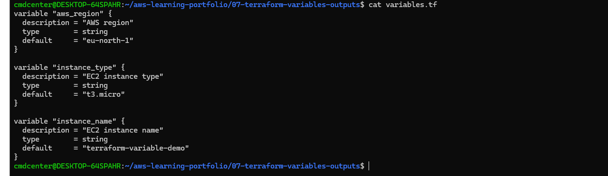
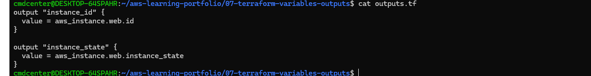
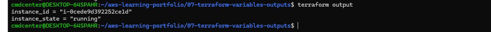
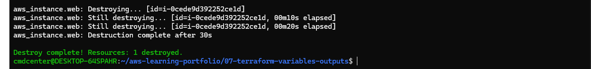

# Terraform Variables and Outputs

## Objective

Learn how Terraform variables and outputs can be used to create reusable and flexible infrastructure configurations.

## What I Did

- Created Terraform input variables
- Used variables to configure AWS resources
- Created Terraform outputs
- Retrieved deployment information using Terraform outputs
- Destroyed the infrastructure after testing

---

## Terraform Variables

Terraform variables allow configuration values to be reused throughout a project.

Instead of hardcoding values such as region, instance type and resource names, variables make the configuration more flexible and easier to maintain.

This approach is commonly used in production environments where the same infrastructure may be deployed multiple times with different settings.

---

## Terraform Outputs

Terraform outputs expose useful information from deployed resources.

Outputs can be used to display values such as instance IDs, public IP addresses and DNS names after deployment.

This makes it easier to retrieve information without manually searching through the AWS Console.

---

## Terraform Output Command

After the infrastructure was deployed, the `terraform output` command was used to retrieve information from the Terraform state.

The output displayed the EC2 instance ID and instance state directly in the terminal.

This demonstrates how Terraform can provide deployment information automatically after provisioning resources.

---

## Terraform Destroy

The `terraform destroy` command removed all infrastructure created during the exercise.

Destroying unused resources is an important cloud administration practice because it prevents unnecessary costs and keeps environments clean.

---

## What I Learned

- How Terraform variables improve reusability
- How Terraform outputs expose deployment information
- How to parameterize infrastructure configurations
- How to retrieve resource information automatically
- Infrastructure lifecycle management with Terraform

---

## Technologies Used

- Terraform
- AWS EC2
- AWS Systems Manager Parameter Store
- Amazon Linux 2023
- Infrastructure as Code (IaC)
- Linux
