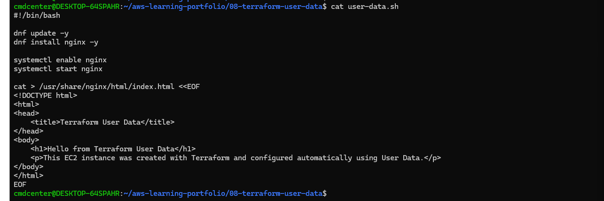
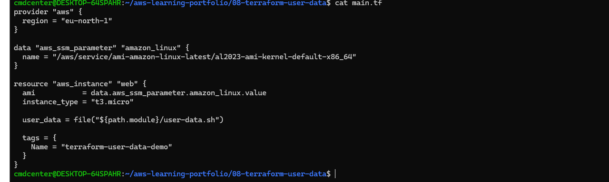
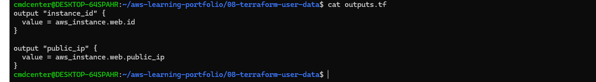
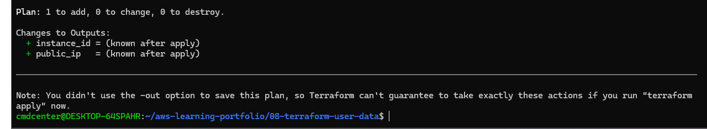
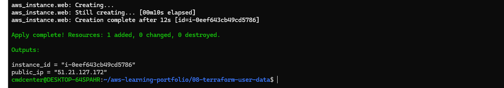
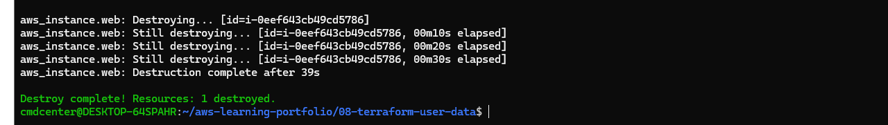

# Terraform User Data

## Objective

Deploy an EC2 instance using Terraform and automatically configure the server during launch using User Data.

## What I Did

* Created an EC2 instance with Terraform
* Used a User Data script to automate server configuration
* Installed and configured Nginx automatically
* Created a custom web page during instance launch
* Used Terraform outputs to display instance information
* Destroyed the infrastructure when testing was complete

---

## User Data Script

The User Data script automatically updates the server, installs Nginx, starts the service, and creates a custom web page.

This allows infrastructure and server configuration to be deployed automatically without manual intervention.

---

## Terraform Configuration

The Terraform configuration deploys an Amazon Linux EC2 instance and references the User Data script during launch.

The User Data file is executed automatically when the instance starts.

---

## Terraform Outputs

Terraform outputs were used to display useful information after deployment.

The configuration returns the EC2 instance ID and public IP address.

---

## Terraform Plan

Terraform Plan was used to preview the infrastructure changes before deployment.

This step helps verify the configuration and avoid unexpected changes.

---

## Terraform Apply and Outputs

Terraform successfully created the EC2 instance and displayed the configured outputs.

The instance ID and public IP address were automatically returned after deployment.

---

## Terraform Destroy

After testing, the infrastructure was removed using Terraform Destroy.

This demonstrates Infrastructure as Code principles where resources can be created and removed on demand.

---

## Lessons Learned

* How User Data automates server configuration
* How Terraform can deploy EC2 instances
* How to use outputs to retrieve deployment information
* How Infrastructure as Code simplifies server provisioning
* The importance of configuring Security Groups when deploying public services

---

## Technologies Used

* Terraform
* Amazon EC2
* Amazon Linux 2023
* User Data
* Nginx
* AWS CLI
* Linux
