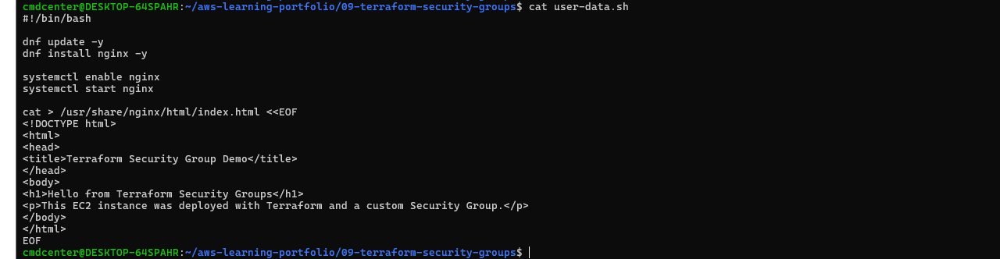
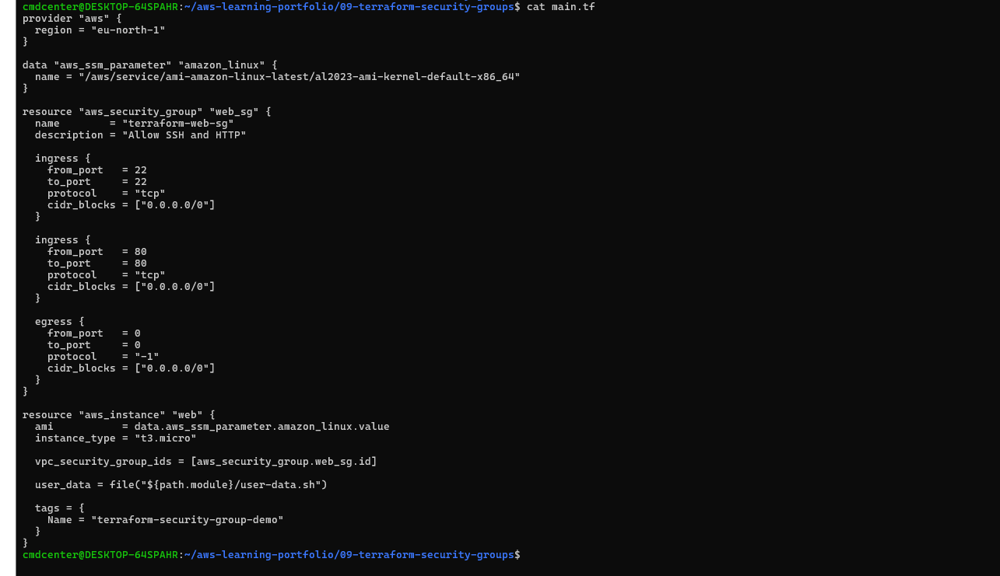
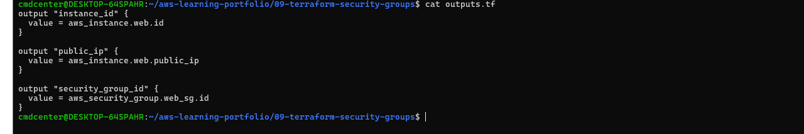
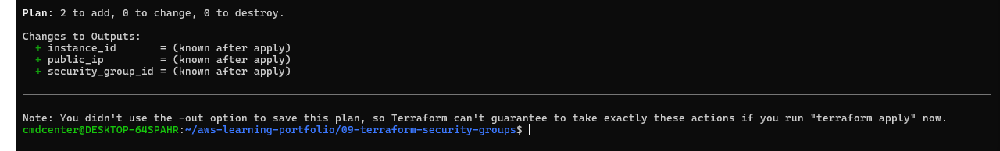
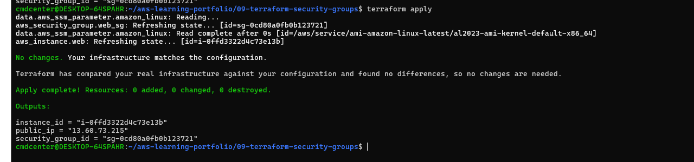
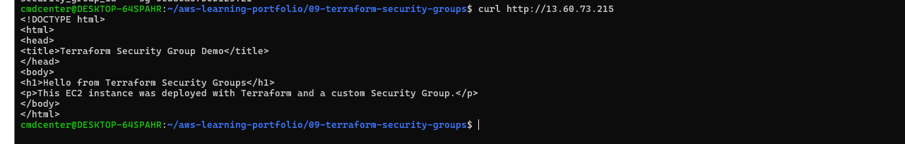
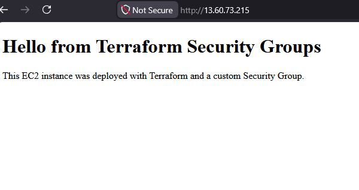
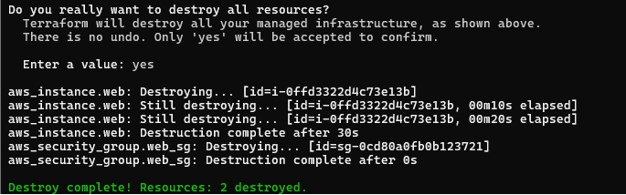

# Terraform Security Groups

## Objective

Deploy a public web server using Terraform while automatically creating and configuring a Security Group for SSH and HTTP access.

## What I Did

* Created a custom Security Group with Terraform
* Allowed SSH access on port 22
* Allowed HTTP access on port 80
* Deployed an EC2 instance
* Used User Data to install and configure Nginx
* Verified public web access
* Tested access through both terminal and browser
* Destroyed the infrastructure after testing

---

## User Data Script

The User Data script automatically installs Nginx, starts the service, and creates a custom web page during instance launch.

This allows the server to be configured automatically without any manual setup after deployment.

---

## Terraform Configuration

The Terraform configuration creates both the Security Group and the EC2 instance.

The EC2 instance automatically uses the Security Group and executes the User Data script during startup.

---

## Terraform Outputs

Terraform outputs provide useful deployment information such as:

* Instance ID
* Public IP Address
* Security Group ID

These values make it easier to verify and manage deployed resources.

---

## Terraform Plan

Terraform Plan was used to preview infrastructure changes before deployment.

The plan confirmed that Terraform would create:

* One Security Group
* One EC2 Instance

This helps prevent unexpected infrastructure changes.

---

## Terraform Apply

Terraform successfully created all required AWS resources.

The deployment returned the public IP address that was later used to verify connectivity and web server functionality.

---

## Public Web Server Verification

The deployed web server was successfully accessed through its public IP address.

The returned HTML content confirmed that:

* The Security Group configuration worked
* User Data executed successfully
* Nginx was installed and running correctly

---

## Browser Verification

The web server was successfully accessed through a web browser using the public IP address assigned by AWS.

This confirmed that:

* HTTP traffic was allowed by the Security Group
* Nginx was serving web content correctly
* The EC2 instance was publicly accessible

---

## Terraform Destroy

After testing, all resources were removed using Terraform Destroy.

This demonstrates Infrastructure as Code principles where infrastructure can be created and removed on demand.

---

## Lessons Learned

* How to create Security Groups using Terraform
* How Security Groups control network traffic
* How to deploy EC2 instances with Infrastructure as Code
* How User Data automates server configuration
* How to verify public web server accessibility
* How to manage infrastructure lifecycles using Terraform
* How to safely remove cloud resources when testing is complete

---

## Technologies Used

* Terraform
* Amazon EC2
* Amazon Linux 2023
* AWS Security Groups
* User Data
* Nginx
* AWS CLI
* Linux
